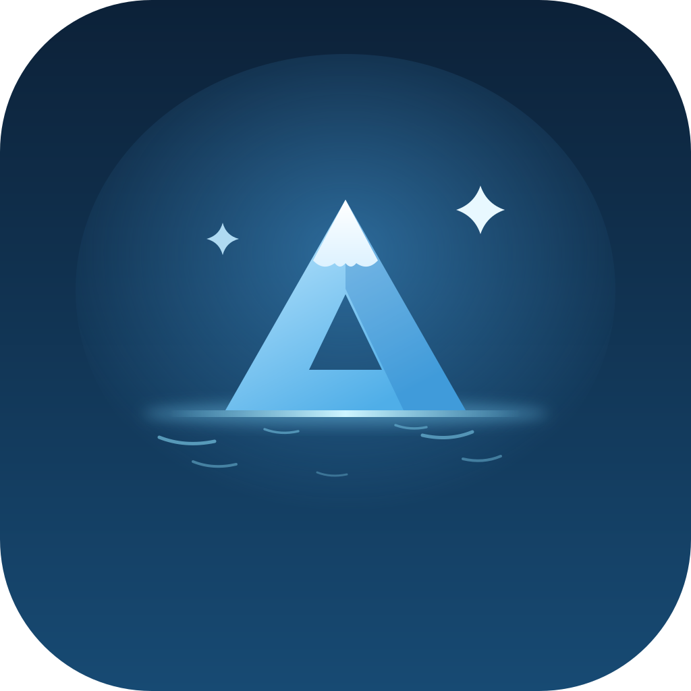
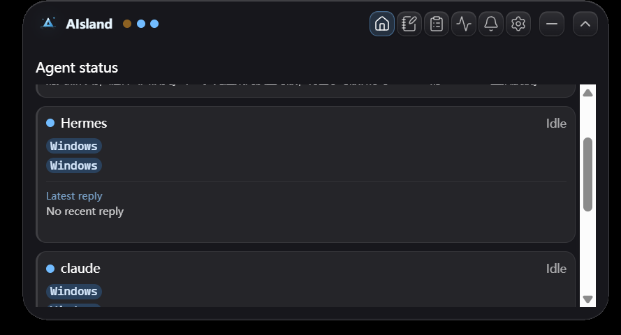
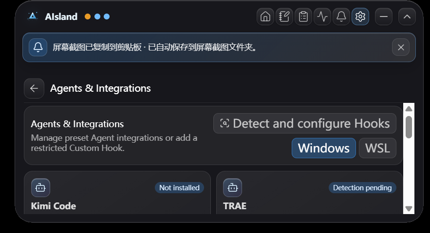
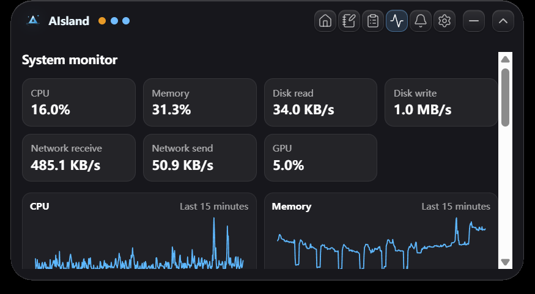

<p align="center">
  
</p>

<h1 align="center">AIsland</h1>

<p align="center">
  A local-first multi-agent status hub for Windows and WSL<br>
  See agent runs, completions, and latest replies without switching windows
</p>

<p align="center">
  <a href="README.md">中文</a> | <strong>English</strong>
</p>

<p align="center">
  <a href="https://github.com/ErdonChen/AIsland/stargazers"></a>
  <a href="https://github.com/ErdonChen/AIsland/actions/workflows/ci.yml"></a>
  <a href="LICENSE"></a>
  
  <a href="https://github.com/ErdonChen/AIsland/releases/tag/preview-v0.1.0.5"></a>
</p>

<p align="center">
  
</p>

<p align="center">
  <a href="https://github.com/user-attachments/assets/9622b5f2-1d83-408c-83ab-e0501eba460e">Watch the full 50-second demo</a>
</p>

## Introduction

AIsland is a floating Windows desktop app that keeps several AI agents in one place. You can see which agent is working, which one has finished, and what it replied most recently without switching between every agent window.

The window stays compact when you do not need it and expands when you want more detail. AIsland also includes Windows notifications, daily Markdown notes, clipboard history, and system monitoring.

## Starship view

Starship view arranges connected agents into a small status array. Agents with recent activity move to the front, and the expanded list scrolls when more agents are open.

<p align="center">
  
</p>

<p align="center">
  
</p>

Status lights use the following colors:

| Color | Status |
| --- | --- |
| Pulsing yellow | Running |
| Steady green | Completed |
| Steady light blue | Idle |
| Steady gray | Offline |
| Red | Failed, waiting, or timed out |

When one agent runs several tasks, AIsland combines their states. A completed task briefly turns the light green. If another task is still running, the light returns to yellow.

## Main features

### Status and latest replies

AIsland shows running, completed, idle, and offline states. Supported native sources also provide the latest assistant reply. Preview text comes only from a verified assistant field. User prompts, reasoning, tool parameters, and tool output are not shown on the island.

### Automatic detection and setup

Open the agents you want to monitor, then go to `Settings > Agents and integrations` and select `Detect and configure Hooks`. AIsland checks supported running agents and uses a native source whenever one is available.

<p align="center">
  
</p>

Detection checks running processes and fixed configuration locations. Native sources remain read-only. AIsland changes only its managed Hook entries, and preserves unrelated configuration, after the user explicitly starts automatic setup.

### Connecting another agent

If an agent is not built in but exposes a callable Hook, add a Custom Hook from the integration page. The first Windows release accepts an existing `.exe`, separate arguments, and an event mapping.

A Custom Hook is a compatibility path, not a replacement for a native adapter. Some features cannot work when the vendor does not expose clear lifecycle events, stable task IDs, or an assistant-only reply field.

### Windows utilities

- Notification center: browse Windows notifications and filter them by source or unread state.
- Daily Markdown notes: save notes by date, search them, copy or export them, and open the notes folder.
- Clipboard history: manage text and image entries with search, filters, pinning, copy, and delete actions.
- System monitor: view CPU, memory, disk, network, and GPU activity.
- Tray and startup controls: hide AIsland in the system tray and manage startup, language, scaling, and appearance from Settings.

<p align="center">
  
</p>

## Agent support

| Agent | Current integration | Status lights | Latest reply |
| --- | --- | --- | --- |
| Codex | Native | Supported | Supported |
| Claude Desktop Cowork | Native | Supported | Supported |
| Hermes | Native | Supported | Supported |
| Cursor | Native | Supported | Supported |
| Kimi / Kimi Work | Native | Supported | Supported |
| WorkBuddy | Native | Supported | Supported |
| QoderWork / Qwen Work | Native | Supported | Supported |
| TRAE / TRAE CN / TRAE SOLO CN / TraeWork | Detected, Hook compatible or pending | Depends on Hook | Not guaranteed |

Native support covers only local session formats that have been verified. A vendor storage update may require a matching adapter update.

## Known limitations

### Hook integrations may expose fewer features

Some agents do not provide a local source that AIsland can read safely, so they must connect through a Hook. A Hook may report only basic status. Latest replies, exact completion timing, multi-task aggregation, and completion transitions are not guaranteed.

### WSL needs broader device testing

AIsland keeps WSL integration paths for Codex and WorkBuddy, but they have not been tested across enough real WSL installations yet. Distribution, mount layout, and agent version differences may affect status or reply detection.

### Privacy boundary

AIsland runs locally and reads supported agent session sources in read-only mode. It extracts only status and the latest assistant text. It does not read or display user prompts, reasoning, tool parameters, or tool output, and it does not guess how to parse unknown databases or logs.

## Basic usage

1. Start AIsland. The compact status island appears at the top of the desktop.
2. Open one or more agents that you want to monitor.
3. Expand AIsland and open `Settings > Agents and integrations`.
4. Select `Detect and configure Hooks`. Native agents use their native source automatically. Other agents show an available Hook or a pending compatibility state.
5. Return to Home to view the status array and latest replies. Use the arrow to collapse the window or the minimize button to leave it running in the system tray.

## Download the Windows preview

Current version: [`preview-v0.1.0.5`](https://github.com/ErdonChen/AIsland/releases/tag/preview-v0.1.0.5)

- [Download the Windows 11 x64 NSIS installer](https://github.com/ErdonChen/AIsland/releases/download/preview-v0.1.0.5/AIsland_0.1.0_x64-setup.exe)
- [View SHA256SUMS.txt](https://github.com/ErdonChen/AIsland/releases/download/preview-v0.1.0.5/SHA256SUMS.txt)
- SHA-256: `09b2218bc6488e4cb8f6981d0f4963c371e98debb2f589e5212cdd24fef4c2f3`

> [!WARNING]
> This is an unsigned preview for technical testers. Windows SmartScreen and UAC may show “Unknown publisher.” Download it only from the official AIsland GitHub repository and verify the SHA-256 checksum before running it. Do not disable Microsoft Defender or SmartScreen.

## Current distribution status

AIsland currently provides an unsigned Windows installer for technical testers, but only as a clearly labeled GitHub Pre-release. Its title and notes must say `Unsigned Preview`, include a SHA-256 checksum, never mark the release as `Latest`, and never publish `latest.json` or place the build on the stable updater channel.

Stable releases for ordinary users, `Latest` releases, and portable executables still require a trusted Authenticode signature and must pass the signed-release gate. Tauri updater signatures protect update integrity but do not replace Windows Authenticode trust. See the [unsigned preview release guide](docs/unsigned-preview-release.md) and [Windows code-signing policy](docs/code-signing.md).

Windows 11 x64 is the supported platform. Windows 10 x64 may work but is not included in the complete release gate. Windows on ARM, macOS, and Linux desktop builds are outside the first-release scope.

## Run from source

You need Windows, Node.js, Rust stable MSVC, Microsoft C++ Build Tools, and WebView2.

```powershell
npx --yes pnpm@10.15.0 install
npx --yes pnpm@10.15.0 tauri dev
```

Run tests and create a production build:

```powershell
npx --yes pnpm@10.15.0 test
cargo test --manifest-path src-tauri/Cargo.toml
npx --yes pnpm@10.15.0 tauri build --no-bundle
```

## Developer documentation

- [Agent capability registry and native adapter guide](docs/agent-integration-capabilities.md)
- [Current architecture decisions](docs/decisions.md)
- [Backend status](docs/backend-status.md)
- [Frontend status](docs/frontend-status.md)
- [Community / Pro boundary](docs/open-core.md)
- [Unsigned preview release guide](docs/unsigned-preview-release.md)
- [Windows code-signing policy](docs/code-signing.md)

## Support AIsland

If AIsland improves your multi-agent workflow, star the repository, share it with another Windows agent user, or open an [Issue](https://github.com/ErdonChen/AIsland/issues) with feedback from a real setup. Reproducible reports directly help AIsland support more agents and WSL environments.

## Contributing, privacy, and licensing

- [Contribution guide and DCO](CONTRIBUTING.md)
- [Privacy notice](PRIVACY.md)
- [Security policy](SECURITY.md)
- [Support policy](SUPPORT.md)
- [Governance](GOVERNANCE.md)
- [Trademarks and branding](TRADEMARKS.md)
- [Apache License 2.0](LICENSE)

This repository is the Apache-2.0 Community Edition. Future paid Pro capabilities may be maintained separately under different terms. Already published Community code keeps its license, and security fixes plus major compatibility fixes for existing Community features remain free.

The public name, installer name, and internal product name are all AIsland. The application identifier is `com.aisland.app`.
